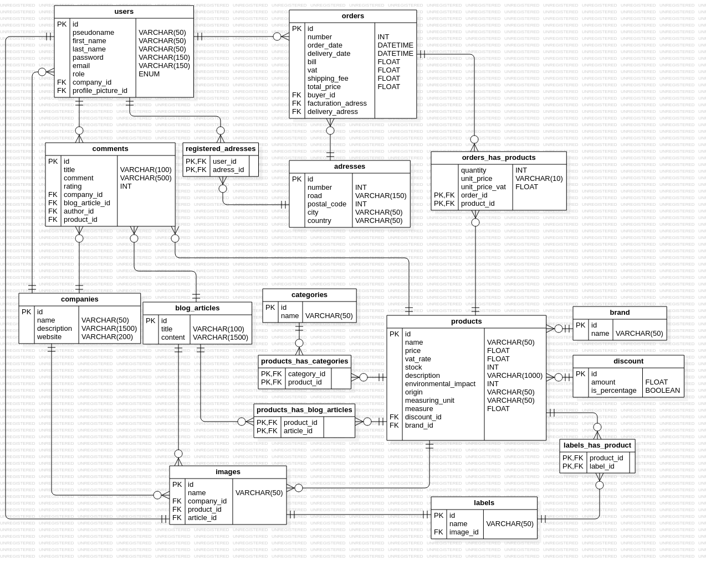

# the database

The next schemas was the first version of the database schemas

In that schemas, please note that each role add a specific interface. Each user has client role by default

Also, those modifications were added:

+ field number and road are fused in adress table (as not every adress has a road number)
+ in order_has_products table, unit_price is on a FLOAT type
+ in orders table, 2 fields are renamed:
  - bill -> total_HT
  - total_price -> total_TTC
+ in orders table, delivery_date become nullable (if their are no delivery)
+ in orders table, the number field is now on VARCHAR(20)
+ A new table named "role_requests" responsible to handle a user role requests to change. This table countain:
  - an id,
  - a role field containing the name of the role
  - a description field added by user to exprime why grant its role
+ A new roles table containing an id and a name.
+ many to many relationship between users and roles table (replacing the role column in users table).
